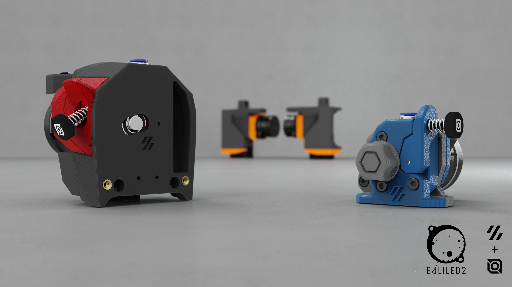

# Galileo 2

## NOTE: Galileo 2 Extruder and G2Z/G2ZXL are currently at RELEASE status.  G2SA is still PUBLIC BETA pending design finalization and testing.



## Welcome everyone, to Galileo 2!

Here you will find all of the files for the Galileo 2 projects, including a Voron Stealthburner drop-in Extruder (G2E), Z-Drives (G2Z) for V2-style printers (including V2, Micron, etc.), and a Standalone Extruder (G2SA) with mounting options for Orbiter-2.0-style or Sherpa-Mini-style mounts.

For those that are curious about what Galileo 2 offers over Galileo 1, here's a short list of benefits:
 * Galileo 2 is a full redesign, moving to a 9:1 gear ratio and optimizing the gearbox design over Galileo 1.  No parts from Galileo 1 are reused with Galileo 2.
 * Custom 9T stepper with a taller spur gear resulting in 20% higher contact surface area than existing 10T stepper designs, resulting in better wear characteristics and power transfer.
 * Proper meshing of gears due to number of stepper teeth being divisible by number of planets (9T sun / 3 planets), which gives even loading on the planets / sun gear and improves wear characteristics and power transfer.  Previous designs with 10T steppers had uneven loading on the planet gears.

## Galileo 2 Resellers List
### <ins>TO NOTE!  ONLY the kits sold by LDO are "official" Galileo 2 kits!</ins>

| Reseller        | Location      | Website                                                                                                                                                                                                                                                                                                                                              |
|---------------- |-------------  |----------------------------------------------------------------------------------------------------------------------------------------------------------------------------------------------------------------------------------------------------------------------------------------------------------------------------------------------------- |
|    Fabreeko     |     USA       | [G2E & G2Z](https://www.fabreeko.com/products/galileo-2-kits-by-ldo-g2e-g2z)                                                                                                                                                                                                                                                                         |
|     West3D      |     USA       | [G2E & G2Z](https://west3d.com/products/galileo-2-kit-by-jaredc01-ldo-motors-g2e-and-g2z-extruder-and-z-drive-kits)                                                                                                                                                                                                                                 |
|   Filastruder   |     USA       | [G2E](https://www.filastruder.com/products/ldo-galileo-v2-kit) / [G2Z](https://www.filastruder.com/products/ldo-galileo-v2-g2z-kit)                                                                                                                                                                                                                  |
|       DFH       |     USA       | [G2E](https://dfh.fm/products/ldo-galileo-2-g2-extruder-kit-ldo-vrn-g2e) / [G2Z](https://dfh.fm/products/ldo-galileo-2-g2-z-drive-kit-ldo-vrn-g2z)                                                                                                                                                                                                   |
|      KB-3D      |     USA       | [G2E](https://kb-3d.com/store/voron/989-ldo-motors-galileo-2-extruder-g2e-for-voron-1694715593330.html) / [G2Z](https://kb-3d.com/store/ldo/1037-ldo-motors-galileo-2-z-drive-kit-g2z-for-v2micron-1701973087997.html) / [G2Z x4 Kit](https://kb-3d.com/store/ldo/1038-ldo-motors-galileo-2-z-drive-kit-g2z-for-v2micron-set-of-4-1701973080481.html) |
|    Sparta3d     |    Canada     | [G2E](https://sparta3d.ca/products/galileo-2-extruder-g2-extruder-g2e) / [G2Z](https://sparta3d.ca/products/galileo-2-z-drive-g2-z-drive-g2z)                                                                                                                                                                                                        |
|    3dlabtech    |    Canada     | [G2E](https://www.3dlabtech.ca/product/ldo-galileo-2-extruder/) / [G2Z](https://www.3dlabtech.ca/product/ldo-galileo-2-z-drive-kit/)                                                                                                                                                                                                                 |
|      Dremc      |  Australia    | [G2E](https://store.dremc.com.au/products/ldo-galileo-2-g2e-for-clockwork-2) / [G2Z](https://store.dremc.com.au/products/ldo-galileo-2-g2-z-for-voron-v2-micronplus)                                                                                                                                                                                 |
|    PhaserFPV    |  Asutralia    | [G2E & G2Z](https://www.phaserfpv.com/products/ldo-galileo-2-kit)                                                                                                                                                                                                                                                                                   |
|  Uniqueprints   |  Australia    | [G2E](https://uniqueprints.shop/shop/ldo/voron-galileo2-g2e-extruder-kit/) / [G2Z](https://uniqueprints.shop/shop/ldo/voron-galileo-2-zdrive-kit-g2z/)                                                                                                                                                                                               |
|    OneTwo3d     |      UK       | [G2E](https://www.onetwo3d.co.uk/product/ldo-galileo-2-extruder-kit/) / [G2Z](https://www.onetwo3d.co.uk/product/ldo-galileo-2-z-drive/)                                                                                                                                                                                                             |
|       3DO       |   Denmark     | [G2E](https://3do.eu/extruder-spare-parts/1232-galileo-2-extruder-kit-by-ldo.html) / [G2Z](https://3do.eu/electronics/1233-galileo-2-z-drive-kit-by-ldo.html)                                                                                                                                                                                        |
|     3Dparts     |   Austria     | [G2E](https://www.3dparts.at/produkt/galileo-2-extruder-kit-by-ldo/)                                                                                                                                                                                                                                                                                |
|     Lecktor     |   Estonia     | [G2E](https://lecktor.com/en/extruders/1480-galileo2-extruder-kit-g2e.html)                                                                                                                                                                                                                                                                         |
|      Zen3d      |   Hungary     | [G2E](https://shop.zen3d.hu/ldo-galileo-2-extruder-g2e) / [G2Z](https://shop.zen3d.hu/ldo-galileo-2-z-drive-g2z)                                                                                                                                                                                                                                     |
|     Lab4450     |   Portugal    | [G2E](https://lab4450.com/product/galileo-2-extruder-kit-by-ldo/) / [G2Z](https://lab4450.com/product/galileo-2-z-drive-kit-by-ldo/)                                                                                                                                                                                                                 |
|  Levendig dsgn  | Netherlands   | [G2E](https://levendigs.com/products/galileo-2-extruder-kit-ldo-motors)                                                                                                                                                                                                                                                                             |
| Jacks Filament  |   Germany     | [G2E](https://www.jacksfilament.com/Galileo-2-Extruder-Kit-G2E-by-LDO)                                                                                                                                                                                                                                                                              |
|    Alchemy3d    |   Germany     | [G2E](https://alchemy3d.de/products/ldo-galileo-2-extruder-kit-pre-order)                                                                                                                                                                                                                                                                           |
|    replimat     |   Germany     | [G2E](https://www.replimat.eu/ldo-galileo-2-extruder-kit/rt10146)                                                                                                                                                                                                                                                                                   |
|      SWBAC      |    Kuwait     | [G2E](https://swbac.com/product/ldo-galileo-2-extruder-kit-ge2/)                                                                                                                                                                                                                                                                                    |
|     Sugoi3d     |    Japan      | [G2E](https://www.sugoi3d.jp/shop/p/galileo-2)                                                                                                                                                                                                                                                                                                      |
|  Trianglelabs   |    Global     | [G2E & G2Z](https://www.aliexpress.com/item/1005006272643489.html)                                                                                                                                                                                                                                                                                  |
|     Mellow      |    Global     | [G2E & G2Z](https://www.aliexpress.com/item/1005006310395949.html)                                                                                                                                                                                                                                                                                  |

## Klipper Settings for G2 Extruders (G2E and G2SA)

You must update both the gear_ratio and rotation_distance in your Klipper configuration and do a standard
[extruder calibration](https://docs.vorondesign.com/build/startup/#extruder-calibration-e-steps) after installing the Galileo 2 Extruder. Additionally, your run_current will need to be updated.
```ini
[extruder]
rotation_distance: 47.088
gear_ratio: 9:1
microsteps: 16

[tmc2209 extruder]
run_current: 0.6
```

## Klipper Settings for G2 Z Drivers (G2Z)

You must update both the gear_ratio and rotation_distance in your Klipper configuration after installing the Galileo 2 Z Driver. Additionally, your run_current will need to be updated.
```ini
[stepper_z]
rotation_distance: 40
gear_ratio: 9:1
microsteps: 32

[tmc2209 stepper_z]
run_current: 0.8
```

<p align="center">
  
</p>
