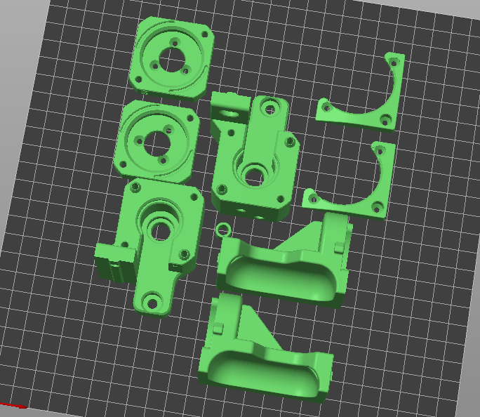

## Galileo 2 Z-Drive (G2Z) STL Files

As a general rule, you will need to print one of each of the STL files included here.  Parts meant to be printed in accent color are marked with "[a]" in front of the file name.  Parts that need to have more than one of the STL file printed will have a trailing number of parts needed (e.g. "x2").

Many/most of the skirt files for G2Z are originally from the Voron Trident release.  Big thanks to Steve for the original design, and for letting me hack them up for G2Z!

