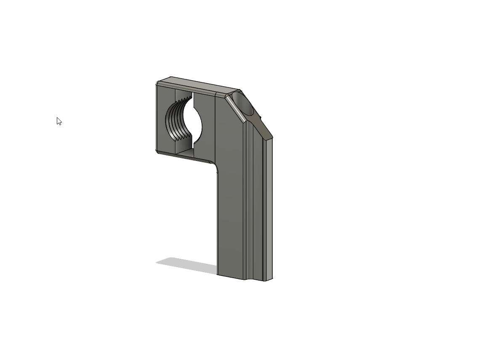
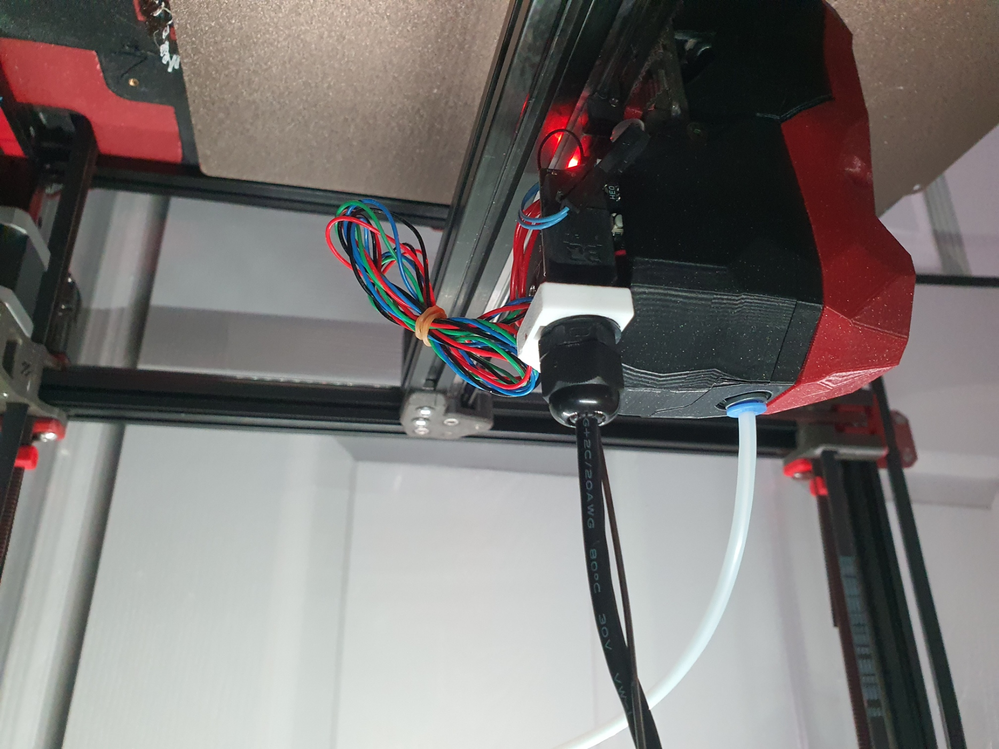
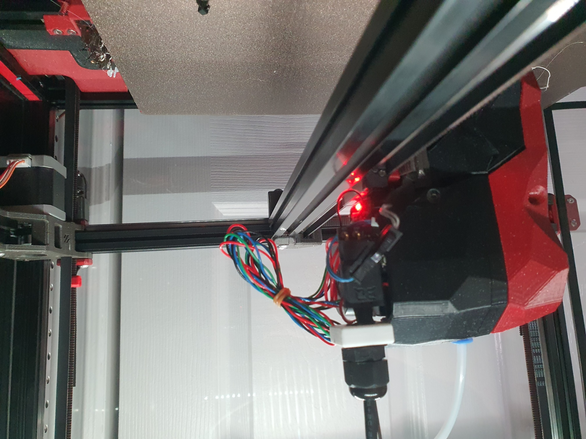

# G2 Umbilical mount for the SB2240 and SB2209

A solution that reduces the slack required when using an umbilical with the PG7 connector. 

The original PG7 mount came from Hartk, I just wanted a solution that reduced hanging wires and the length of the extruder. 

Print with voron settings, In the orientation provided.  Your filament needs to have good layer adhesion.

## BOM

| Name | Pieces |
| ------ | ------ |
| 50 mm M3 screw | 1| (Included with most kits)

