# G2 Umbilical's mounts for Z chains

Galileo 2, as amazing as it is, is longer than stock Clockwork, so it requires dedicated umbilical mounting solutions if you have the stock Z chain (at least on the V2's).

The original motor mount idea came from Hartk.

There are two versions of the umbilical mount.

One for the SB PCB style toolhead boards (SB Toolhead PCB, FLY-SB-2040, EBB SB2209/SB240, SB CAN TH, etc), and another for motor mounted boards (Huvud, FLY-SHT36/42, EBB36/42, etc)

Without further delay, you can access the relevant sections below:

[SB PCB Version]()

[Motor mount Version]()

# SB PCB version

The toolhead PCB's are secured on the standard Galileo 2 location with the umbilical mount attaching to the chain holder location and to a motor screw.
The mount also includes a chamber temp holder and allows for a microfit 2x2 and a XT30(2+2) to pass on the PG7/M12 attachment (both original from Hartk)

## BOM

| Name | Pieces |
| ------ | ------ |
| 6 mm M3 screw | 1|
|8 mm M3 screw| 1|
|12 mm M3 screw| 1 |
| 50 mm M3 screw                                               | 1      |
| PG7 tension relief (Gland or Cnlinko LP12)                   | 1      |
| 12 mm metal standoff (optional, but recommended) ([affliated link](https://s.click.aliexpress.com/e/_DmuMxL5)) | 2|
|M3 heatset inserts (if not using the 12mm metal standoff)| 2|

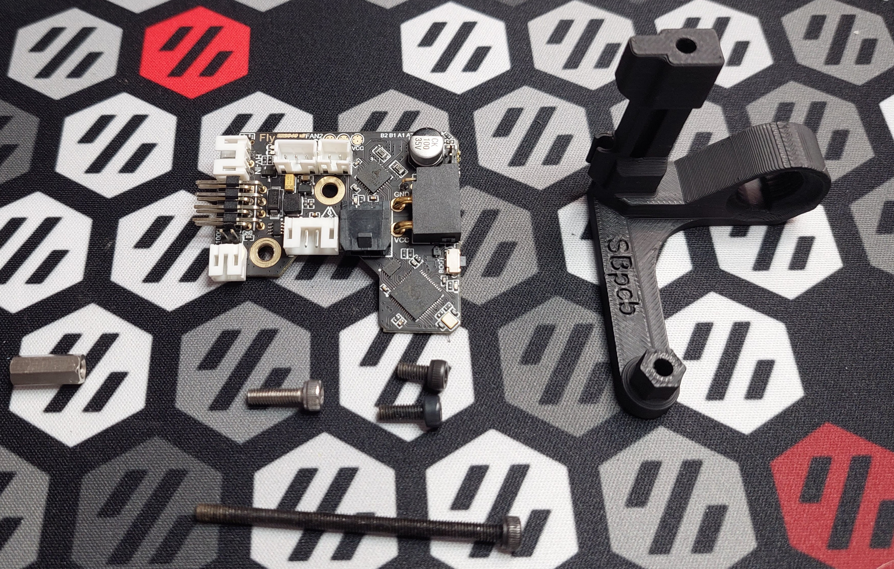

## Printed parts (located on the STL folder)

| Name | Pieces |
| ------ | ------ |
| G2_CAN_mount_SBpcb_PG7 or M12 | 1|
| 12mm_printed_standoff (if not using a metal one) | 1|
| G2_cable_cover_for_CAN | 1 |

## Build

| Instruction | Image |
| ------ | ------ |
|1. Attach the m12 metal standoff, or the printed version (with one m3 heatset insert on each end) to the G2 lower motor screw, like on the photo.|  |
|2. Now attach the PCB to Galileo 2 using the 2 location provided, you should use a 6mm and 8mm m3 screws.  | 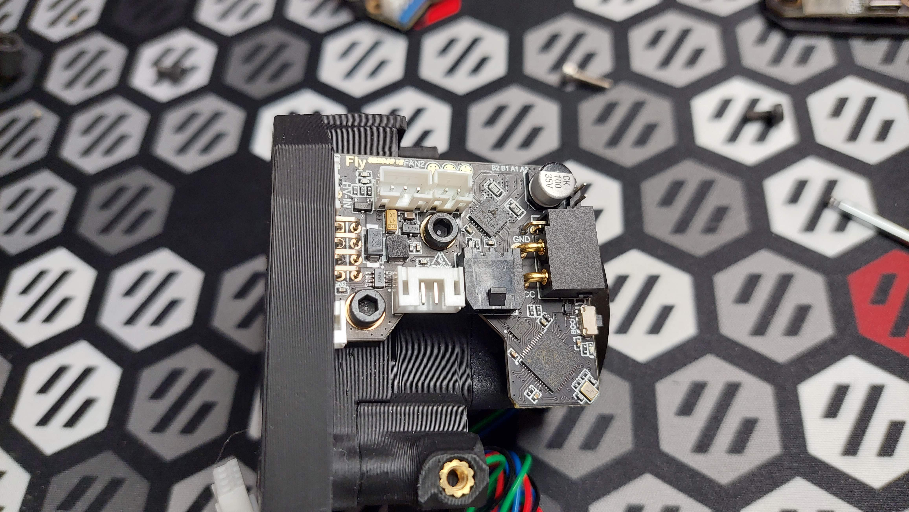 |
|3. Atach the printed part G2_CAN_mount_SBpcb_PG7 or M12, depending on your gland version to the G2 body, the top part is secured by a 50mm m3 screw and the bottom one by a 10/12mm one. You may need to force the bottom screw to move to it's correct position before screwing it.|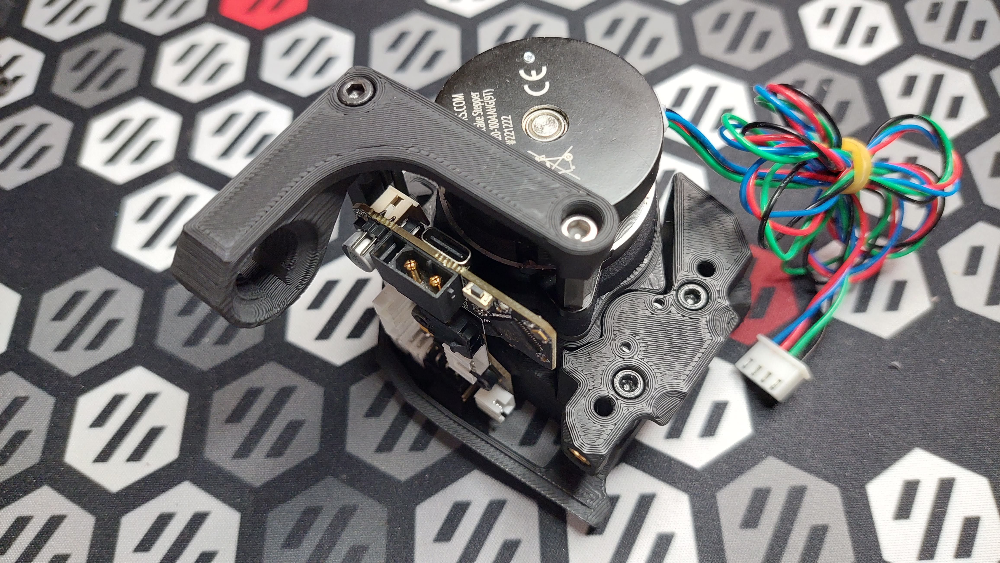|
|4. As you can see, the XT30(2+2) can pass on the gland hole.|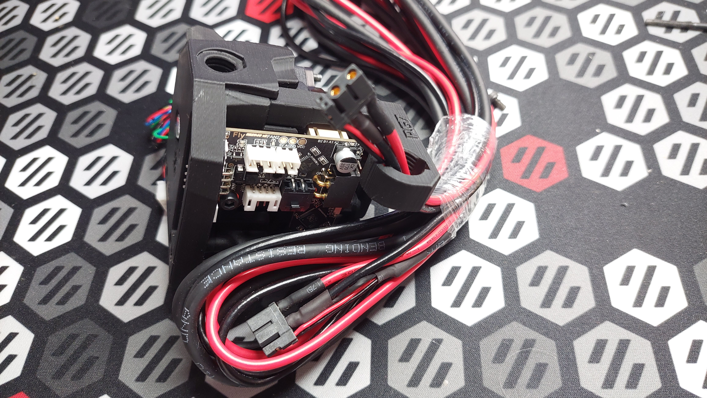|
|5. the final product, you can now use it as you would normally would, you can use the G2_cable_cover_for_CAN to cover the front part of the toolhead, it mounts the same way as the original.||

# Motor mount Version

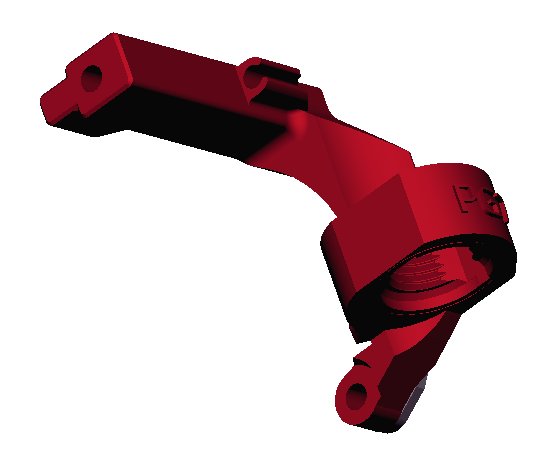

The Motor mount is secured on the standard Galileo 2 via the chain holder location and to a motor screw.
The mount also includes a chamber temp holder and allows for a microfit 2x2 and a XT30(2+2) to pass on the PG7/M12 attachment (both original from Hartk).
There's a small support that's included to minimize the footprint of the screw.

## BOM

| Name                                                      | xxx42 | xxx36 |
| --------------------------------------------------------- | ----- | ----- |
| 6 mm M3 screw                                             | 1     | 2     |
| 12 mm M3 screw                                            | 2     | 1     |
| 40/50 mm M3 screw                                         | 1     | 1     |
| PG7 tension relief (Gland or Cnlinko LP12)                | 1     | 1     |
| 12 mm metal standoff (optional, but recommended)          | 2     | 2     |
| M3 heatset inserts (if not using the 12mm metal standoff) | 4     | 4     |

| 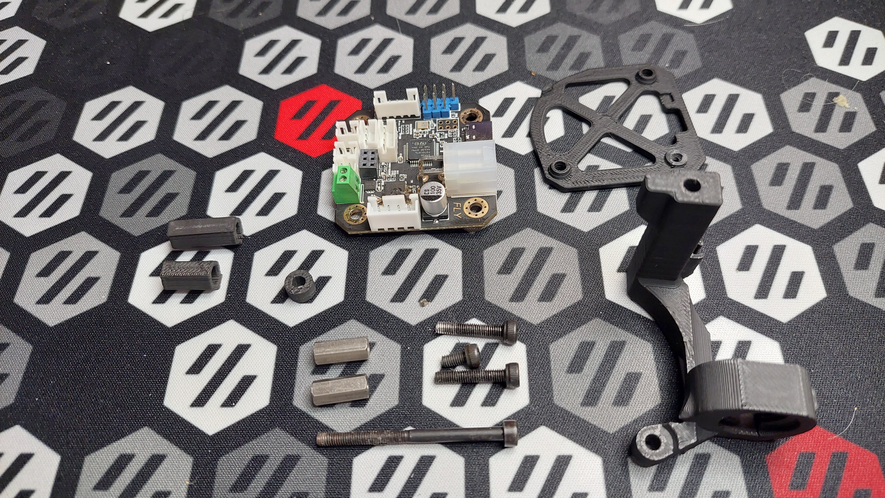 | 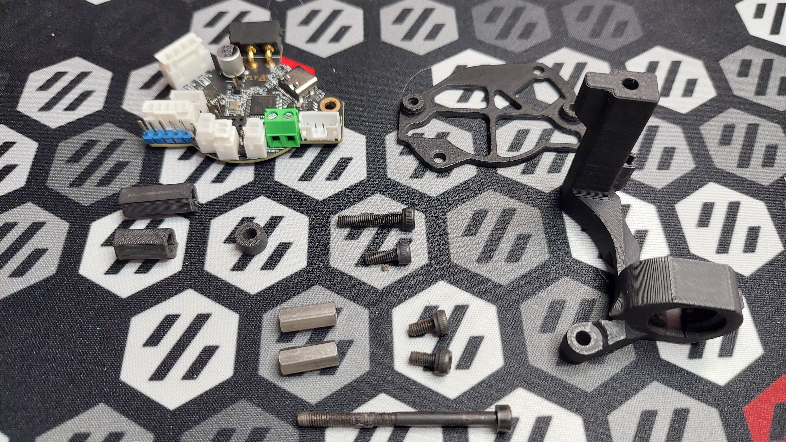 |
| ------------------------------------ | ----------------------------------------------------- |

## Printed parts (located on the STL folder)

| Name                                             | xxx42 | xxx36 |
| ------------------------------------------------ | ----- | ----- |
| G2_CAN_mount_motor_PG7 or M12                    | 1     | 1     |
| 12mm_printed_standoff (if not using a metal one) | 2     | 2     |
| G2_cable_cover_for_CAN                           | 1     | 1     |
| 4mm_spacer                                       | 1     | 1     |
| xxx42_holder                                     | 1     | 0     |
| xxx36_holder                                     | 0     | 1     |

## Build

| Instruction                                                  | Image                                                        |
| ------------------------------------------------------------ | ------------------------------------------------------------ |
| 1. Remove the printed support on the G2_CAN_mount_motor part. | 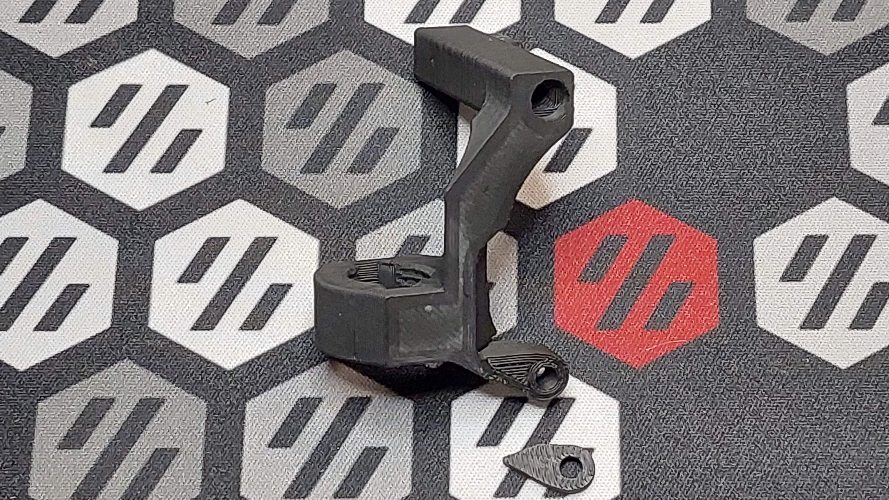                    |
| 2. Attach the m12 metal standoffs, or the printed versions (with one m3 heatset insert on each end) to the G2 lower motor screws, like on the photo. | 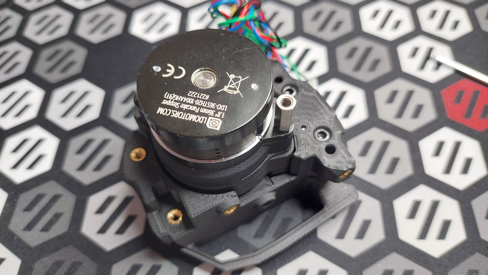                      |
| 3. Attach the printed part G2_CAN_mount_motor PG7 or M12, depending on your gland version to the G2 body, the top part is secured by a 40 to 50mm m3 screw, the bottom will be secured later by the toolhead holder. |           |
| 4. now secure the xxx36/42 to the respective holder, the xxx36 uses two 6mm m3 screws on both attachment locations, the xxx42 uses a 6mm m3 screw on the bottom right attachment location (highlighted in red). | 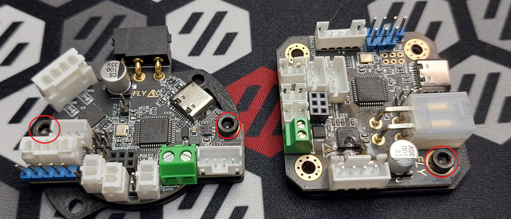                 |
| 5. Now, use a 12mm m3 screw on the top right xxx32/46 holder attachment location with the printed 4mm spacer below the holder (highlighted in red), the screw in the image is a 16mm one, but a 12mm also works and is on the Voron BOM. | 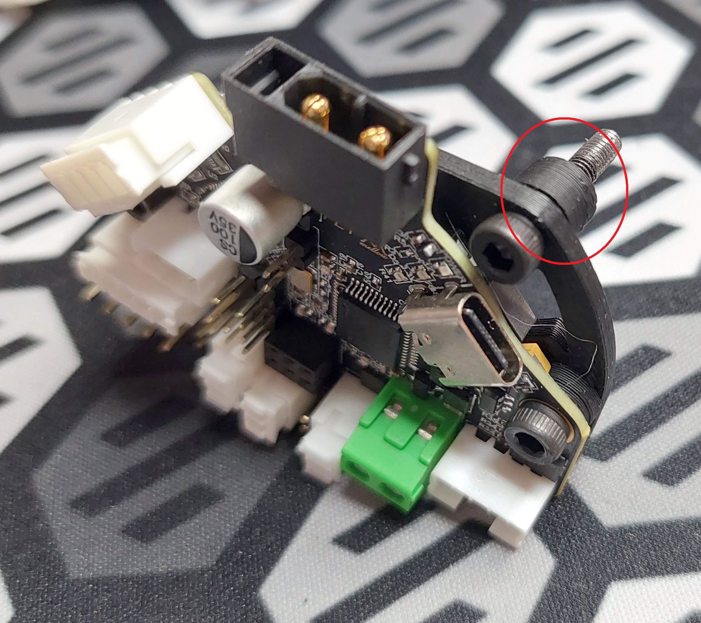                 |
| 6. now secure the holder with the top screw on the top motor standoff and to the bottom one with a 12mm m3 screw (highlighted in red). |  |
| 7. Now use the G2_cable_cover_for_CAN to cover the front part of the toolhead, it mounts the same way as the original. |  |
| 8. the final product, you can now use it as you would normally would | 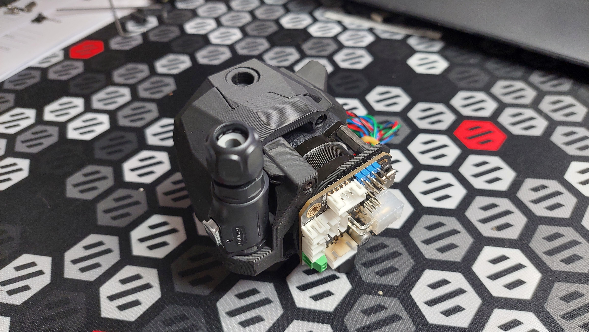                 |

## Last remarks

This would of course not happen if not for the excellent work of jaredc01 on developing Galileo 2 and of Hartk for it's design ideas.

Also Kudos to all the Voron Discord Contributors that tested these parts.

Right now, you can find me on Voron discord, as jos.ar, it's the best place to get help on these parts.
