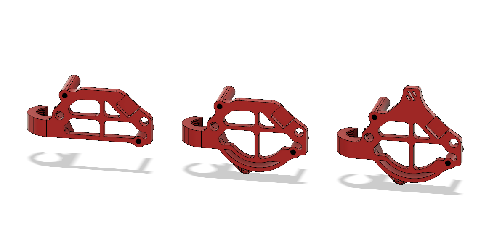

# G2 Umbilical's mounts for Z chains

Galileo 2, as amazing as it is, is longer than stock Clockwork, so it requires dedicated umbilical mounting solutions if you have the stock Z chain (at least on the V2's).

The original motor mount idea came from Hartk.

