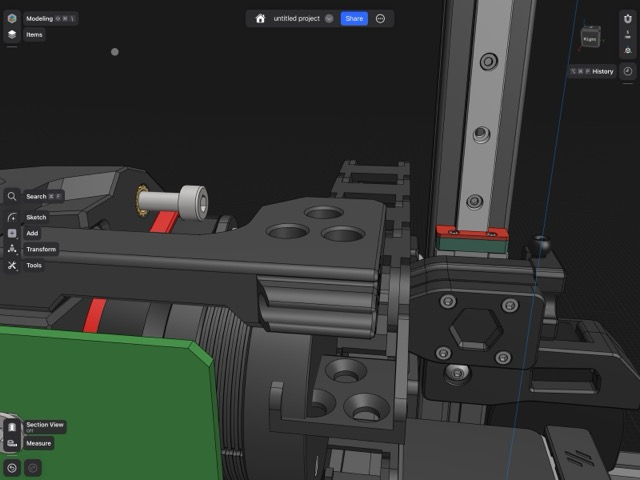

# G2E Switchwire Cable Chain Anchors

The standard cable chain anchor is a little too short to properly line up with the X cable chain on the Switchwire.

## BOM 
M3x50 SHCS ( this should be in the G2 Kit) 

## Misaligned

## New Part

