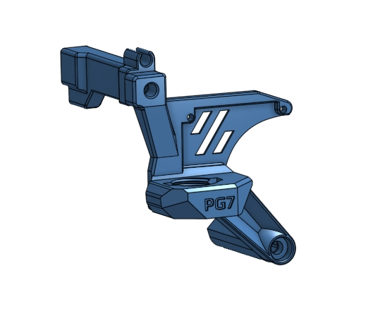

# Umbilical LDO Nozzle Camera Board Mount
This is a mashup of hartk [ G2E Umbilical ](./hartk/G2E_Umbilical) and Baze_24616 [G2E Umbilical LDO Nozzle Camera Board Mount](https://www.printables.com/model/632078-galileo-2-g2e-lp-12-umbilical-3do-nozzle-camera-mo) for those that might have a LDO Nozzle Camera that want to use G2E. You may need to use a little longer ribbon cable. I used a [100 mm 24 pin cable](https://www.amazon.com/gp/product/B09R8X8Y6Q/ref=ppx_yo_dt_b_asin_title_o00_s00?ie=UTF8&th=1) and an [extension connector](https://www.amazon.com/gp/product/B07RWF5BCK/ref=ppx_yo_dt_b_asin_title_o00_s01?ie=UTF8&psc=1) to reach the board location.

