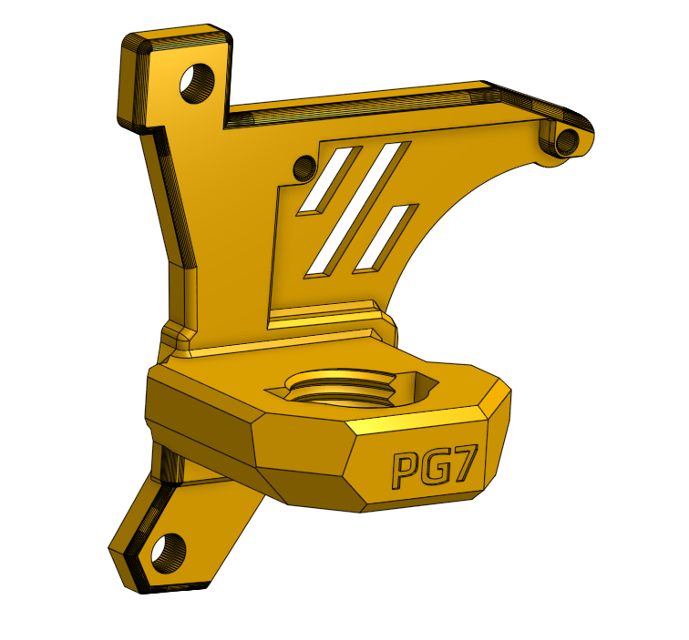

# Galileo 2 (G2E) LP-12 PG7 Umbilical & 3DO Nozzle Camera Mount
This is a mod of [Baze_24616](https://www.printables.com/model/632078-galileo-2-g2e-lp-12-umbilical-3do-nozzle-camera-mo) & [hartk](/user_mods/hartk/PG7_Umbilical) to add a mount for the 3DO Nozzle Camera Board but keep the same threads as the one from hartk.

